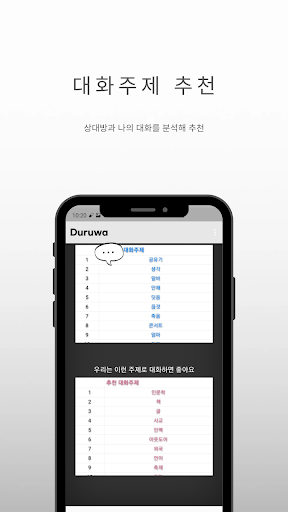

카카오톡 대화 데이터를 이용한 시각화 및 분석 web


# install and start

- python 3.7
- ubuntu 18.04

1. git clone 

2. 라이브러리 설치
```commandline
pip install -r requirements.txt
```

3. konlpy 설치 (window는 다른방법으로 설치)
```commandline
sudo apt-get install g++ openjdk-8-jdk python3-dev python3-pip curl \
python3 -m pip install konlpy 
```

4. 서버 실행
```commandline
python main.py
```

5. web 실행후 카카오톡 대화 txt 파일을 사용하여 분석

# 제공하는 기능





