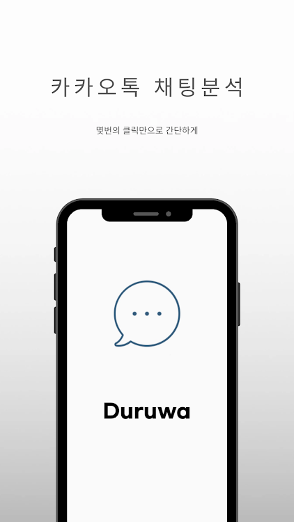

# KakaoTalkChatAnalysis_Duruwa
카카오톡 대화 데이터를 이용한 시각화 및 분석 어플리케이션

Duruwa는 몇번의 클릭만으로 카카오톡 채팅을 분석해주는 어플리케이션 입니다. 단체 채팅방도 지원하지만
1:1 채팅에서 더 많은 분석을 제공합니다.

1) 제공하는 기능

- 1:1 채팅방과 단체채팅방을 지원합니다.
- 사용자간의 채팅횟수 비율
- 사진사용 비율
- 이모티콘 사용비율
- 채팅횟수가 많은 날 - 시간, 요일, 년월, 년월일
- 톡방에서 대화가 몇일 연속으로 끊겼었는지
- 톡방에서 대화가 연속으로 이어졌는지
- 사용자 시간별 대화수(개인별 측정)
- 사용자 요일별 대화수(개인별 측정)
- 사용자 년별 대화수(개인별 측정)
- 사용자 년월별 대화수(개인별 측정)

- 상대방과 나의 말투 (1:1채팅방만 지원)
- 머신러닝 알고리즘을 이용해 상대방과
나의 대화주제를 확률적으로 추출 (1:1채팅방만 지원)
- 대화주제 추천 (1:1채팅방만 지원)
